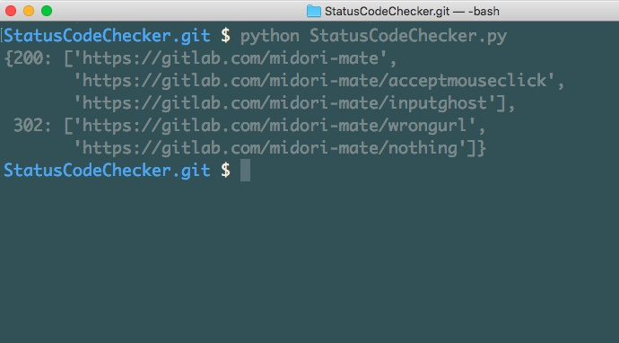

StatusCodeChecker
===

好きなだけURL書いてください。
ステータスコードごとに整理します。
時間はかかるけどね。ごめんね。

- Docker: 対応!
- Python: 3.14!
- Linter: ruff!
- Test: pytest!

## パッと実行してみたい

```bash
printf 'https://example.com/\nhttps://example.com/nothing\n' > urls.txt
docker compose run --rm app urls.txt
```

urls.txt の URL を 1 つずつ GET して、ステータスコードごとにまとめて表示します。

```
200
  https://example.com/
404
  https://example.com/nothing
```

## 使い方

- 入力は 1 行 1 URL です。空行と `#` で始まる行は無視し、重複は 1 回だけ調べます。
- ファイルは複数渡せます。渡さないか `-` を渡すと標準入力を読みます: `docker compose run --rm -T app < urls.txt`
- リダイレクトは追いません。3xx はそのまま 3xx として報告します。
- 応答がない URL はクラッシュせず `TIMEOUT` / `CONNECTION_ERROR` / `INVALID_URL` / `ERROR` のグループに入ります。
- `--timeout 秒` で 1 URL あたりのタイムアウトを変えられます (既定 10 秒)。
- `--workers 数` で同時に調べる URL の数を増やせます (既定 1)。出力の順番は変わりません。
- オプションの詳しい説明は [docs/options.md](docs/options.md) にあります。
- User-Agent は `status-code-checker` で送ります。
- 終了コードは、全部応答があれば 0、エラーグループがあれば 1、使い方の誤り (URL なし、読めないファイル、不正なオプション値) なら 2 です。

## 開発

```bash
docker compose run --rm test   # pytest (ローカルの HTTP フィクスチャだけを使います)
docker compose run --rm lint   # ruff check + ruff format --check
```

GitHub Actions (`.github/workflows/ci.yml`) でも同じ lint とテストを回します。


